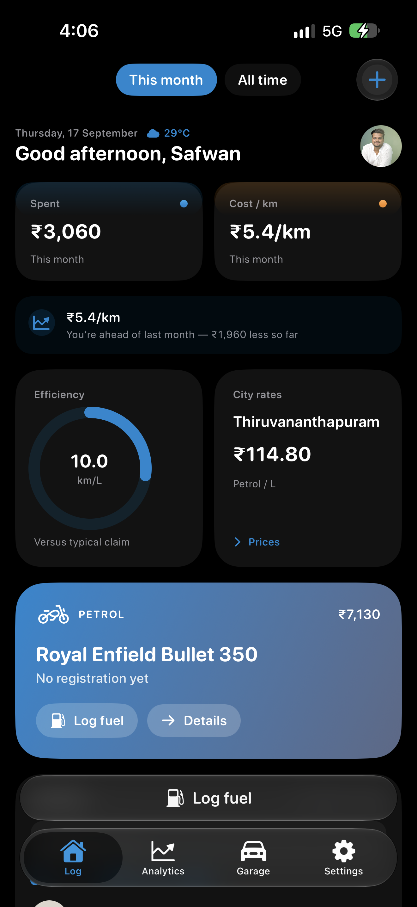
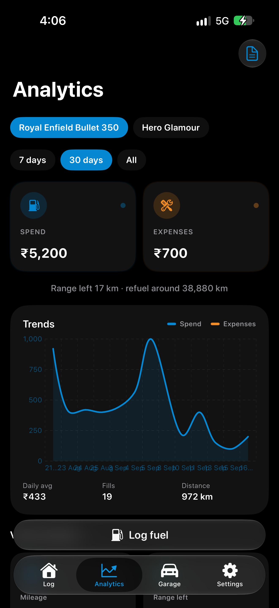
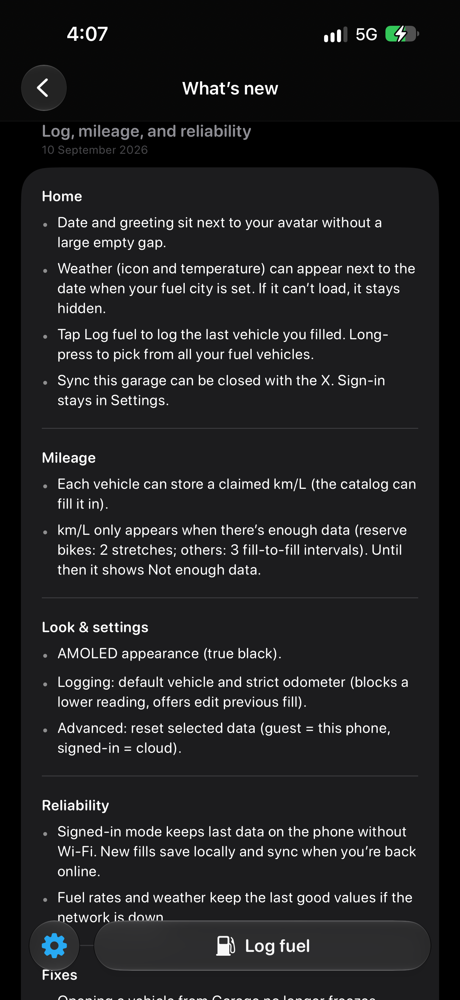

# OdoLog 🚗⛽

OdoLog is a modern, feature-rich iOS application built with Swift and SwiftUI designed to track the fuel efficiency of your daily drivers using manual logging methods.

  
  
  

## ✨ Key Features

### 🏠 Home Dashboard
* **Dynamic Header:** Date and a welcoming greeting sit tight next to your user avatar.
* **Live Weather:** Automatically displays weather icons and temperature when your fuel city is set (gracefully hides if unavailable).
* **Quick Actions:** Tap **Log fuel** to quickly log your last filled vehicle, or long-press to choose from your entire garage.
* **Offline Resilience:** Works seamlessly offline—cached data stays accessible, new fills save locally, and data syncs automatically once reconnected.

### 📊 Mileage & Analytics
* **Smart km/L Tracking:** Calculates fuel efficiency dynamically based on vehicle type (requires 2 stretches for reserve vehicles, 3 fill-to-fill intervals for others).
* **Comprehensive Reports:** Access monthly and yearly analytical breakdowns right from the Garage or Analytics toolbar.
* **Garage Status Badges:** Instantly spot vehicles needing attention with "On reserve" and "Service due" indicators.

### ⚙️ Look, Settings & Control
* **AMOLED True Black:** Clean, true black dark-mode interface optimized for OLED screens.
* **Strict Odometer Controls:** Built-in safeguards prevent entering lower odometer readings, with options to override or correct previous fills.
* **Flexible Reminders:** Local notifications for service dates (3 days prior & day-of) and daily reserve tank reminders.
* **Smart CSV Import:** Automatically skips exact duplicates, supports replacing matching vehicle logs, and provides detailed result toasts on import status.

## 🛠️ Built With
* **Swift** / **SwiftUI**
* **Xcode**

## 📱 Installation (Sideloading)

Since OdoLog is distributed as an independent iOS application, you can sideload the `.ipa` file onto your device using your preferred installation tool:

1. **Download the latest `.ipa` file** from the [GitHub Releases](https://github.com/onewordpic/OdoLog/releases) page.
2. Choose your installation method:
   * **AltStore / Sideloadly:** Connect your iPhone to your Mac or PC, open your sideloading tool of choice, select the downloaded `.ipa` file, and sign it with your Apple ID.
   * **TrollStore:** If your iOS version is compatible, you can install the `.ipa` file directly through TrollStore without signing restrictions.
3. Trust the developer profile on your iOS device via **Settings > General > VPN & Device Management** if required, then open the app.
