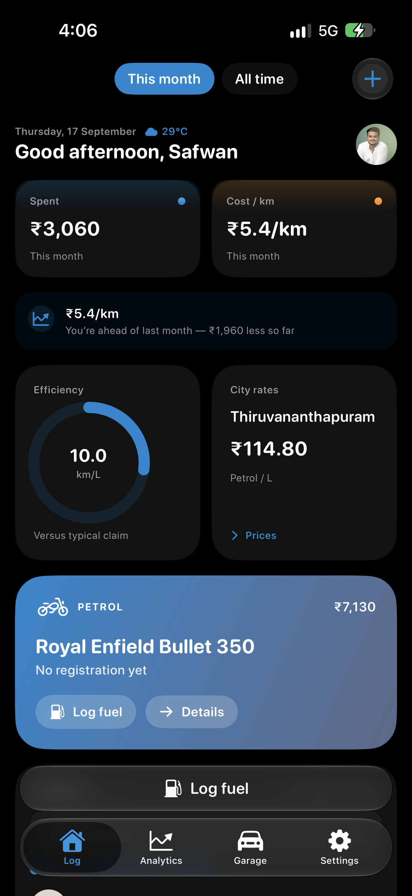
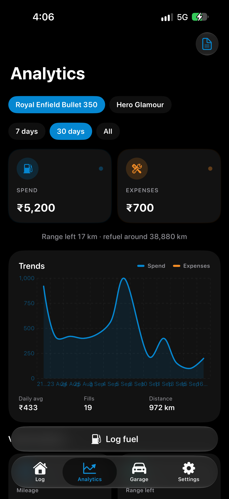
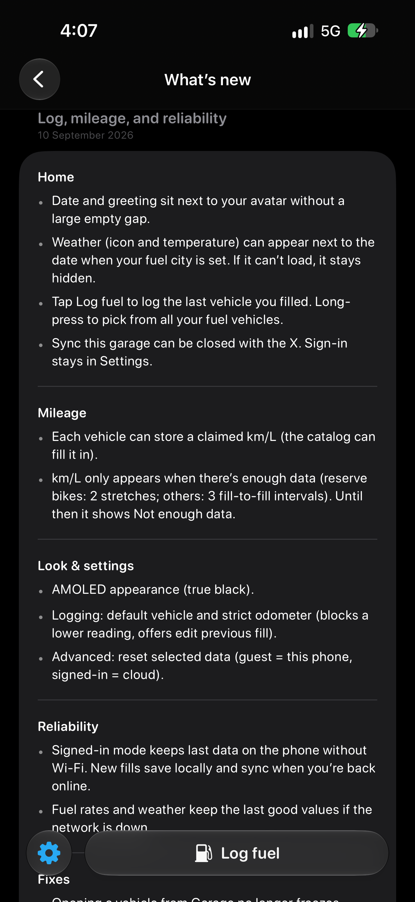

# OdoLog 🚗⛽

OdoLog is an iOS app built with Swift and SwiftUI that tracks the real fuel efficiency of your bikes and cars from manual fuel logs. **Current version: 1.1**

  

## ✨ What's new in 1.1

- **Reserve odometer prompt:** switching a bike to reserve now asks for the odometer reading at that moment.
- **Auto return to main tank:** a refuel of ₹100 or more on a bike that is on reserve puts it back on the main tank.
- **Accurate mileage:** km/L is calculated by a separate, tested calculator using the exact distance and litres between reserve points. Unusual entries are left out, and you can see why each one was skipped.
- **Entry checks:** odometer typos and litres that don't match the amount are flagged. On Apple Intelligence devices this runs on-device, otherwise a simple rule-based check is used. It never changes the km/L figure.
- **Reliable pull-to-refresh:** one pull syncs your fills, fuel prices and weather, with no false error alerts, and works quietly offline.
- **Siri and Shortcuts:** log fuel, set reserve, and ask for your mileage by voice.
- **Steady layout:** the home card no longer jumps when you toggle reserve.

## ✨ Key Features

### 🏠 Home Dashboard
- **Dynamic Header:** date and greeting sit next to your avatar.
- **Live Weather:** shows weather and temperature when your fuel city is set, and hides if unavailable.
- **Quick Actions:** tap **Log fuel** for your last filled vehicle, or long-press to choose any vehicle in your garage.
- **Offline Resilience:** cached data stays available, new fills save locally and sync when you're back online.

### 📊 Mileage & Analytics
- **Smart km/L:** reserve bikes need 2 reserve stretches, other vehicles need 3 fill-to-fill intervals. The result is total km divided by total litres, not an average of averages.
- **Sanity checks:** stretches with bad odometer values, missing fuel, broken history, or an impossible km/L are excluded with a reason.
- **Reports:** monthly and yearly breakdowns from the Garage or Analytics tab.
- **Garage badges:** "On reserve" and "Service due" indicators.

### 🗣️ Siri & Shortcuts
- Log fuel, set reserve, and get your mileage with App Shortcuts, for example "Log fuel in OdoLog" or "What's my mileage in OdoLog".

### ⚙️ Look, Settings & Control
- **AMOLED True Black** dark mode.
- **Strict Odometer Controls:** blocks readings lower than the last one, with options to correct the previous fill.
- **Reminders:** local notifications for service dates (3 days before and on the day) and reserve tank reminders.
- **Smart CSV Import:** skips exact duplicates, can replace matching vehicle logs, and shows the import result.

## 🛠️ Built With
- **Swift** / **SwiftUI** / **SwiftData**
- **App Intents** for Siri and Shortcuts
- **Xcode**

## 📱 Installation (Sideloading)

OdoLog is distributed as an independent iOS app, so you can sideload the `.ipa` with your preferred tool:

1. **Download the latest `.ipa`** from the [GitHub Releases](https://github.com/onewordpic/OdoLog/releases) page.
2. Choose your installation method:
   - **AltStore / Sideloadly:** connect your iPhone to your Mac or PC, select the `.ipa` and sign it with your Apple ID.
   - **TrollStore:** if your iOS version is compatible, install the `.ipa` directly without signing restrictions.
3. If asked, trust the developer profile under **Settings > General > VPN & Device Management**, then open the app.
